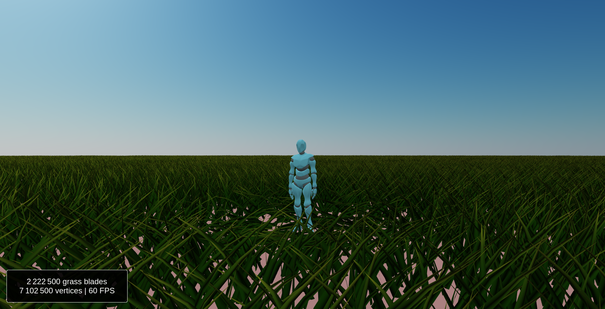

# Asset Scattering

[](https://github.com/BarthPaleologue/babylonjs-template/actions/workflows/webpack.yml)
[](https://github.com/BarthPaleologue/AssetScattering/actions/workflows/deploy.yml)



A procedural asset scattering system built with BabylonJS. It can render millions of blades of grass with LoD and cute butterflies.

## Online demo

Main demo with procedural terrain, lod, collisions, butterflies and trees: [here](https://barthpaleologue.github.io/AssetScattering/)

Large flat grass field with lod and butterflies: [here](https://barthpaleologue.github.io/AssetScattering/field.html)

Minimal example of a dense patch of grass: [here](https://barthpaleologue.github.io/AssetScattering/minimal.html)

If you can't run the demo, there is a video on YouTube [here](https://www.youtube.com/watch?v=0I5Kd784K6A).

## How to use

The files for the asset scattering are located in the folder `src/ts/instancing`.

There are 3 types of patches: `InstancePatch`, `ThinInstancePatch` and `HierarchyInstancePatch`. They all use the same interface `IPatch` so they are interchangeable.

The first thing to do is to create a matrix buffer for the patch which will contain all positions, scaling and rotations of the instances. There is a utility function in each patch class to create a simple square patch (look at `src/ts/minimal.ts` to see it in action).

When the buffer is created, it is just a matter of passing it to the patch constructor and then calling `createInstances()` on the instance with the mesh you want to instantiate.

### Which patch to use?

If you want raw speed, prefer `ThinInstancePatch`. It is faster because it uses a single draw call for all the instances. However, you give up the ability to have collisions on your instances.

On the other hand, `InstancePatch` is slower, but you get a list of `InstancedMesh` that you can tweak individually. This is useful if you want to have collisions on your instances.

`HierarchyInstancePatch` is a special case of `InstancePatch` that allows to instantiate hierarchies of meshes. It can be useful for complex objects or GLTF models.

### Manage LoD

This is completely optional, but you can have LoD with your patches by using a `PatchManager`. 

The Manager takes an array of meshes describing the different LoD levels of your base mesh and a function that defines the LoD as a function of the distance to the camera.
Then, you simply add your patches to the manager and call `update()` on the manager every frame. The manager will take care of updating the LoD of your patches.

This may result in frame drops if your patches have a lot of thin instances, this might be solved in the future but this is not a priority for now.

### Collisions

To enable collisions on an `InstancePatch`, simply set `checkCollisions=true` on your base mesh. Then moving objects with `moveWithCollisions` will respect the collisions.

## Resources

The grass rendering is based on [this video](https://www.youtube.com/watch?v=bp7REZBV4P4) from Simon Dev. It is itself based on [this gdc conference](https://www.youtube.com/watch?v=Ibe1JBF5i5Y).

The wind sound effect is from [this video](https://www.youtube.com/watch?v=a3aFMAalCpk).

## Run locally

```bash
npm install
npm run serve
```
