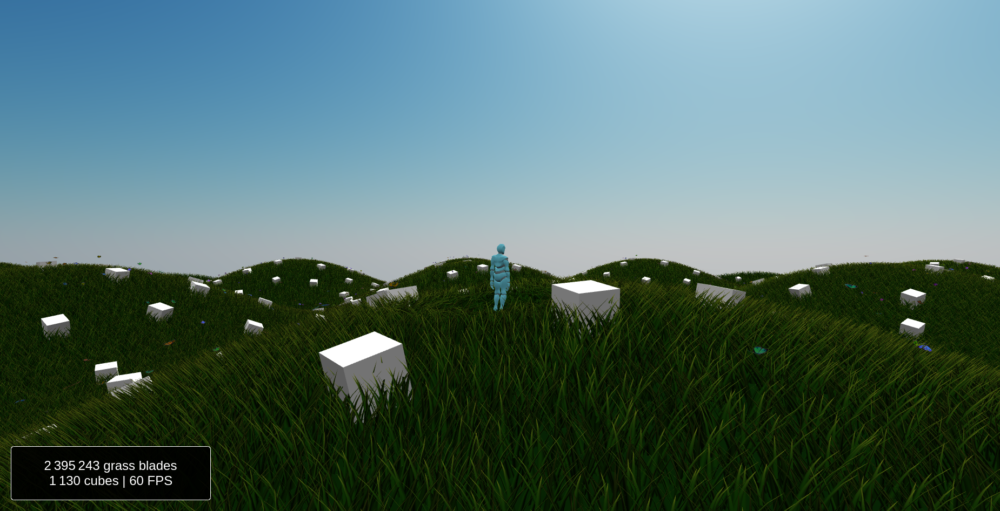

# Asset Scattering

[](https://github.com/BarthPaleologue/babylonjs-template/actions/workflows/webpack.yml)
[](https://github.com/BarthPaleologue/AssetScattering/actions/workflows/deploy.yml)



An asset scattering system built with BabylonJS.

The grass rendering is based on [this video]() from Simon Dev. It is itself based on [this gdc conference]().

The wind sound effect is from [this video](https://www.youtube.com/watch?v=a3aFMAalCpk).

```
npm run build
```

or

```
yarn build
```

to bundle your application
